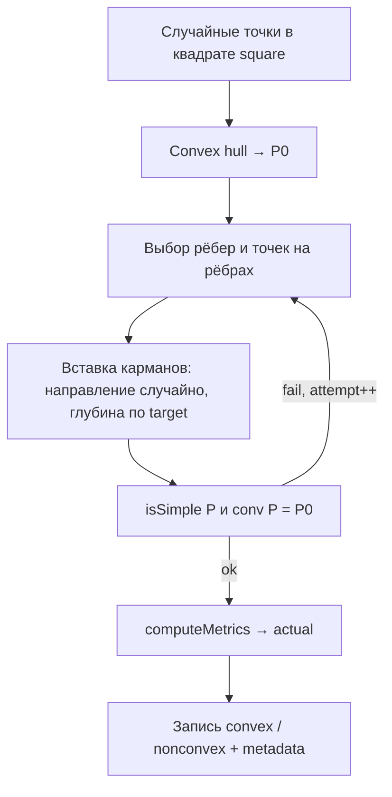

# План реализации генератора полигонов (HousdorfPolygonGen)

Документ описывает целевую архитектуру генератора пар **P₀** (выпуклая оболочка) / **P** (невыпуклый простой контур) для бенчмарка `grid_plus_shor`, `multi_step_method` и исследования применимости **УЛЛ** в зависимости от метрик невыпуклости.

---

## 1. Цель эксперимента

Построить воспроизводимый датасет, в котором:

1. **P₀** — произвольный выпуклый многоугольник (не зафиксированный класс «вписанных в круг»).
2. **P** — простой невыпуклый контур с \(\mathrm{conv}(P) = P_0\).
3. Невыпуклости задаются **целевым числом** и **целевыми метриками** (с записью `target` / `actual` в `metadata.csv`).
4. Для демонстрации влияния метрик на УЛЛ параметры меняются по **диапазону** и **шагу** (`experiment.json` → `sweep_planner`).

Связь с бенчмарком: `min_t H(P, P_0 + t)`; эталон — плотная сетка / мультистарт; метрика ошибки УЛЛ строится по join `metadata.csv` ↔ результаты оптимизации.

---

## 2. Пайплайн генерации (целевой)



### 2.1. Выпуклый шаблон P₀

| Параметр | Источник |
|----------|----------|
| Область | `square` из `experiment.json` (`xmin`, `xmax`, `ymin`, `ymax`) |
| Облако | `points_per_hull` случайных точек, равномерно в квадрате |
| P₀ | `convexHull(cloud)` (Graham / Andrew) |
| Отбраковка | `|P₀| < min_hull_vertices` → новая попытка (редко, ≤ несколько попыток) |

**Инвариант:** P₀ сохраняется в `*_polygon_convex.txt` и **не пересчитывается** после построения P.

**Почему hull от точек в квадрате:** даёт широкий класс выпуклых форм (вытянутые, неровные стороны) без привязки к правильному n-угольнику в окружности.

### 2.2. Невыпуклости: вставка на **ребре**, не сдвиг вершины

**Старое (не целевое):** `pushVertexReflex` — сдвиг существующей вершины P₀ внутрь по биссектрисе/к центроиду.

**Целевое:**

1. Выбрать ребро P₀: \((V_i, V_{i+1})\).
2. Выбрать точку \(T\) на ребре: \(T = V_i + \tau (V_{i+1} - V_i)\), \(\tau \sim \mathrm{Uniform}(0.05, 0.95)\) (не в вершинах).
3. Задать **случайное** единичное направление \(u\) в **внутренний** полуплоскость относительно ребра (чтобы карман шёл внутрь P₀):
   - базис: внутренняя нормаль к ребру \(n_{\mathrm{in}}\);
   - \(u = \mathrm{rotate}(n_{\mathrm{in}}, \theta)\), \(\theta \sim \mathrm{Uniform}(-\theta_{\max}, +\theta_{\max})\) (по умолчанию \(\theta_{\max} \approx 60°\)–\(80°\));
   - отбросить, если \(u\) выводит за пределы локального «клина» между соседними рёбрами (проверка знака cross).
4. Построить **карман** как короткую цепочку новых вершин \(Q_1, \ldots, Q_m\) вдоль направления \(u\) с глубиной по `depth_rel_target`, шириной по `pocket_width_rel` / `bridge_width_rel`.
5. Вставить цепочку в контур P между \(V_i\) и \(V_{i+1}\) (замена отрезка ребра ломаной «внутрь»).

**Произвольность направления** обеспечивает разнообразие форм впадин; **контроль метрик** — через геометрические рычаги (глубина, длина хорды на оболочке, число точек кармана) и 1–2 итерации калибровки `depthCoeff` под `area_ratio`.

**Простота P:** после каждой вставки и в конце — `geom::isSimple(P)`; при пересечении — откат кармана или уменьшение глубины / угол θ.

**Инвариант conv(P) = P₀:** все новые вершины строго внутри P₀; рёбра P₀ не выходят наружу → крайние точки оболочки остаются вершинами P₀.

### 2.3. Число карманов

| Параметр | Описание |
|----------|----------|
| `dent_count` | Сколько независимых карманов на один P₀ |
| Размещение | Рёбра с минимальным зазором по индексу (как `pickPocketStarts` / по дуге периметра) |
| `replicate` | Несколько P с одним target на уровне sweep (разный `seed`) |

---

## 3. Метрики (определения)

Все **относительные** величины нормируются масштабом P₀: \(D = \sqrt{\mathrm{area}(P_0)}\) или диаметр, \(L = \mathrm{perimeter}(P_0)\).

| Ключ в `experiment.json` | Имя | Определение (actual) | Роль в генерации |
|--------------------------|-----|----------------------|------------------|
| `alpha_lebedev` | Лебедев (α) | **Цель:** полная α(M) по биссектрисе (офлайн или модуль `alpha_lebedev.cpp`). **Пока:** `alpha_proxy` = max по reflex-вершинам угла \(\pi - \angle ABC\) (нижняя оценка, не совпадает с α Лебедева). | Ось sweep; режим `target_bins` — подгонка попыток |
| `depth_rel` | Относительная глубина | \(\max_{q \in P} \mathrm{dist}(q, \partial P_0) / D\) | Рычаг: длина смещения кармана вдоль \(u\) |
| `bridge_width_rel` | Относительная ширина моста | Длина хорды на **P₀** между концами кармана / \(L\) | Рычаг: сколько рёбер P₀ «занимает» вход в карман (span по оболочке) |
| `pocket_width_rel` | Относительная ширина впадины | Ширина устья кармана / \(D\) (хорда или размах первой/последней точки кармана) | Рычаг: число точек / поперечный размах ломаной у ребра |
| `area_ratio` | Отношение площадей | \(\mathrm{area}(P_0) / \mathrm{area}(P) \ge 1\) | Калибровка глубины (итерация scale `depthCoeff`) |

В `metadata.csv` для каждой оси sweep: `*_target` (из job) и `*_actual` (после `computeMetrics`).

**Важно для статьи/отчёта:** в тексте различать `alpha_proxy` и настоящую меру Лебедева; при финальных графиках «метрика → Δ_УЛЛ» для оси `alpha_lebedev` использовать либо полный α, либо явно подписать proxy.

---

## 4. Управление метриками: диапазон, шаг, sweep

Конфигурация (`experiment.json`):

```json
{
  "square": { "xmin": 0, "xmax": 1000, "ymin": 0, "ymax": 1000 },
  "points_per_hull": 64,
  "min_hull_vertices": 6,
  "dent_count": 2,
  "seed_base": 42,
  "count": 0,
  "threads": 8,
  "sweep_mode": "one_at_a_time",
  "sweeps": {
    "depth_rel":         { "min": 0.02, "max": 0.35, "step": 0.03 },
    "bridge_width_rel":  { "min": 0.05, "max": 0.40, "step": 0.05 },
    "pocket_width_rel":  { "min": 0.05, "max": 0.35, "step": 0.05 },
    "area_ratio":        { "min": 1.02, "max": 1.40, "step": 0.04 },
    "alpha_lebedev":     { "min": 0.10, "max": 1.20, "step": 0.10 }
  }
}
```

Уровни: `min, min+step, …, max` (`sweepLevels`).

| `sweep_mode` | Назначение для УЛЛ |
|--------------|-------------------|
| `one_at_a_time` | **Основной:** одна метрика меняется, остальные = медиана диапазона → кривая «ось → actual → Δ_УЛЛ» |
| `full` | Малые сетки, smoke-тесты |
| `lhs` | Разрежённое покрытие гиперпараметров |
| `target_bins` | Подгонка `alpha` (до 3 попыток на job) |

**Рекомендация для демонстрации УЛЛ:**

1. Прогнать 5 прогонов `one_at_a_time` (по одной оси из таблицы метрик).
2. На каждый run — `benchmark_polygon_files.py` + УЛЛ (когда реализован).
3. Построить scatter: `depth_rel_actual` (и др.) vs `|f_ULL - f_grid| / f_grid`.

`count` в JSON может быть 0: число кейсов = сумма длин осей × `replicate` (логика в `planJobs`).

---

## 5. Выходные данные

```
run_YYYYMMDD_HHMMSS/
  experiment.json
  metadata.csv
  <case_id>/
    <case_id>_polygon_convex.txt      # P0
    <case_id>_polygon_nonconvex.txt   # P
```

Формат вершин: первая строка `n`, далее `x y` (как в `benchmark_polygon_files.load_polygon`).

Колонки `metadata.csv` (минимум):

`case_id; seed; dent_count; depth_rel_target; depth_rel_actual; bridge_width_rel_target; bridge_width_rel_actual; pocket_width_rel_target; pocket_width_rel_actual; area_ratio_target; area_ratio_actual; alpha_lebedev_target; alpha_lebedev_actual; reflex_count; n_hull; sweep_axis; sweep_level; replicate`

---

## 6. Параллелизм и производительность

- Планирование jobs: `planJobs(cfg)` — однопоточно, детерминировано.
- Генерация: `batch_runner` — поток `t` обрабатывает `jobs[i]` где `i % threads == t`.
- Запись: буфер CSV на поток или lock только на append (как сейчас).
- Без SVG в batch (`preview_every` только для отладки).
- **α Лебедева (полная):** не в hot path; опциональный пост-проход `tools/compute_alpha.py`.

Целевое время: тысячи кейсов за секунды–минуты на 8–16 ядрах (при `points_per_hull` ≤ 64, `dent_count` ≤ 4).

---

## 7. Состояние кода и план доработок

| Компонент | Статус | Действие |
|-----------|--------|----------|
| `square_sampler`, `convexHull`, `isSimple` | есть | — |
| `experiment_config`, `sweep_planner`, `batch_runner` | есть | синхронизировать имена осей с п. 3 |
| `case_generator` (hull → dents) | есть | — |
| `dent_builder` (сдвиг вершин) | **устаревает** | заменить на `edge_pocket_builder` (п. 2.2) |
| `metric_calculator` | есть | после нового кармана уточнить `bridge_*` / `pocket_*` по геометрии вставки |
| `alpha_lebedev` (точная) | нет | фаза 5, офлайн |

### Фаза 1 — Контракт и sweep (готово / поддержка)

- [x] Пара convex / nonconvex, `metadata.csv`, `experiment.json`
- [x] `one_at_a_time`, `full`, `lhs`, `target_bins`
- [ ] Пример `experiment_ull_demo.json` с рекомендуемыми диапазонами для всех 5 осей

### Фаза 2 — `edge_pocket_builder` (критично)

- [ ] `insertPocketOnEdge(P, hull, edge_i, tau, direction_u, depth, pocketVerts)`
- [ ] Случайное направление в допустимом конусе
- [ ] Подбор `depth`, span рёбер под `depth_rel`, `bridge_width_rel`, `pocket_width_rel`
- [ ] Калибровка `area_ratio` (1–2 итерации)
- [ ] Удалить или обернуть `pushVertexReflex` как legacy

### Фаза 3 — Связка targets ↔ actual

- [ ] Документировать формулы actual в README
- [ ] Тест: при фиксированном seed уменьшение `depth_rel` target → монотонное (в среднем) уменьшение `depth_rel_actual`
- [ ] Лог отклонений `|target - actual|` в metadata для калибровки коэффициентов

### Фаза 4 — Демонстрация УЛЛ

- [ ] Скрипт / notebook: join metadata + benchmark + ULL
- [ ] 5 sweep-прогонов, графики по осям

### Фаза 5 — α Лебедева (опционально)

- [ ] Биссектриса / супремум α по Лебедеву 2007
- [ ] Замена `alpha_proxy` в отчётах или колонка `alpha_lebedev_full`

---

## 8. Псевдокод `generateCase`

```
generateCase(cfg, job):
  for attempt in 0..maxAttempts:
    cloud = sampleSquare(cfg.square, points_per_hull, rng)
    P0 = convexHull(cloud)
    if |P0| < min_hull_vertices: continue

    P = P0
    pockets = planPockets(P0, job.targets, cfg.dent_count, rng)
    for pocket in pockets:
      if not insertPocketOnEdge(P, P0, pocket): rollback pocket
    if not isSimple(P) or isConvex(P): continue

    metrics = computeMetrics(P0, P, pockets)
    optional: calibrate to targets (area_ratio, alpha_bins)
    return { P0, P, metrics }

  return failed
```

---

## 9. Критерии готовности (Definition of Done)

1. P₀ из hull точек в квадрате; не менее 3 различных «форм» при визуальной выборке 30 SVG-preview.
2. Карманы строятся **вставкой на ребро**, не сдвигом вершины P₀.
3. Все принятые P — простые; `conv(P) = P₀` (тест: hull(P) ≈ P₀).
4. Sweep по каждой из 5 метрик даёт монотонный разброс `*_actual` вдоль оси.
5. `benchmark_polygon_files.py` читает run без ошибок.
6. Документирован join для графика «метрика → ошибка УЛЛ».

---

## 10. Связанные файлы

| Файл | Назначение |
|------|------------|
| `HausdorffPolygonGen/case_generator.cpp` | оркестрация попыток |
| `HausdorffPolygonGen/dent_builder.*` | **→** `edge_pocket_builder.*` |
| `HausdorffPolygonGen/metric_calculator.*` | actual-метрики |
| `HausdorffPolygonGen/sweep_planner.*` | jobs из диапазонов |
| `HausdorffPolygonGen/batch_runner.cpp` | параллельный run |
| `README.md` | сборка, CLI, бенчмарк |
